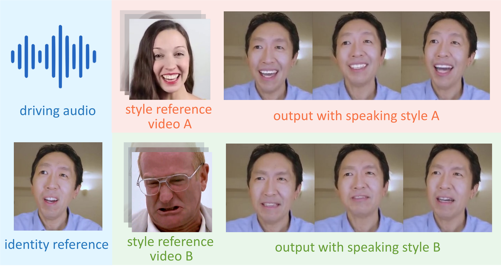

# StyleTalk

The official repository of the AAAI2023 paper [StyleTalk: One-shot Talking Head Generation with Controllable Speaking Styles](https://arxiv.org/abs/2301.01081)

<p align='center'>
  <b>
    <a href="https://arxiv.org/abs/2301.01081">Paper</a>
    | 
    <a href="https://drive.google.com/file/d/19WRhBHYVWRIH8_zo332l00fLXfUE96-k/view?usp=share_link">Supp. Materials</a> 
    |
    <a href="https://youtu.be/mO2Tjcwr4u8">Video</a>
  </b>
</p> 

  <p align='center'>  
    
  </p>

  The proposed **StyleTalk** can generate talking head videos with speaking styles specified by arbitrary style reference videos.

# News
* April 14th, 2023. The code is available.

# Get Started

## Installation

Clone this repo, install conda and run:

```bash
conda create -n styletalk python=3.7.0
conda activate styletalk
pip install -r requirements.txt
conda install pytorch==1.8.0 torchvision==0.9.0 torchaudio==0.8.0 cudatoolkit=11.1 -c pytorch -c conda-forge
conda update ffmpeg
```

The code has been test on CUDA 11.1, GPU RTX 3090.

## Data Preprocessing
Our methods takes 3DMM parameters(\*.mat) and phoneme labels(\*_seq.json) as input. Follow [PIRenderer](https://github.com/RenYurui/PIRender) to extract 3DMM parameters. Follow [AVCT](https://github.com/FuxiVirtualHuman/AAAI22-one-shot-talking-face) to extract phoneme labels. Some preprocessed data can be found in folder `samples`.


## Inference
Download checkpoints for [StyleTalk](https://drive.google.com/file/d/1z54FymEiyPQ0mPGrVePt8GMtDe-E2RmN/view?usp=share_link)  and [Renderer](https://drive.google.com/file/d/1wFAtFQjybKI3hwRWvtcBDl4tpZzlDkja/view?usp=share_link) and put them into `./checkpoints`.

Run the demo:

```bash
python inference_for_demo.py \
--audio_path samples/source_video/phoneme/reagan_clip1_seq.json \
--style_clip_path samples/style_clips/3DMM/happyenglish_clip1.mat \
--pose_path samples/source_video/3DMM/reagan_clip1.mat \
--src_img_path samples/source_video/image/andrew_clip_1.png \
--wav_path samples/source_video/wav/reagan_clip1.wav \
--output_path demo.mp4
```

Change `audio_path`, `style_clip_path`, `pose_path`, `src_img_path`, `wav_path`, `output_path` to generate more results.

# Acknowledgement
Some code are borrowed from following projects:
* [AVCT](https://github.com/FuxiVirtualHuman/AAAI22-one-shot-talking-face)
* [PIRenderer](https://github.com/RenYurui/PIRender)
* [Deep3DFaceRecon_pytorch](https://github.com/sicxu/Deep3DFaceRecon_pytorch)
* [Speech Drives Templates](https://github.com/ShenhanQian/SpeechDrivesTemplates)
* [FOMM video preprocessing](https://github.com/AliaksandrSiarohin/video-preprocessing)

Thanks for their contributions!